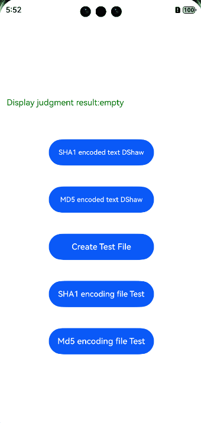

# Checksum

## Introduction
This project is used to calculate the most typical hash functions such as MD5 or SHA-1.

## Effect


## How to Install
```shell
ohpm install @ohos/checksum
```
For details about the OpenHarmony ohpm environment configuration, see [OpenHarmony HAR](https://gitcode.com/openharmony-tpc/docs/blob/master/OpenHarmony_har_usage.en.md).

## How to Use
1. Use SHA-1 and MD5 to encode a string.

    ```
    @Entry
    @Component
    struct Index {
      @State mgs: string = "null"
      @State path: string = ""
      @State mArguments:options = new options();
    
      build() {
        Flex({ direction: FlexDirection.Column, alignItems: ItemAlign.Center, justifyContent: FlexAlign.Center }) {
          Button("Use SHA-1 to encode the string dshaw").width(200).height(50).onClick((event: ClickEvent) => {
            this.mArguments.algorithm = "sha1"
            let mChecksum = new Checksum()
            
            this.mgs = mChecksum.checksum("dshaw", this.mArguments)
          })
    
          Button("Use MD5 to encode the string dshaw").width(200).height(50).onClick((event: ClickEvent) => {
            this.mArguments.algorithm = "md5"
            let mChecksum = new Checksum()
            
            this.mgs = mChecksum.checksum("dshaw", this.mArguments)
          })
          }
    ```

2. Use SHA-1 and MD5 to encode a file.

    ```
    @Entry
    @Component
    struct Index {
      @State mgs: string = "null"
      @State path: string = ""
      @State mArguments:options = new options();
    	// The file exists.
      build() {
        Flex({ direction: FlexDirection.Column, alignItems: ItemAlign.Center, justifyContent: FlexAlign.Center }) {
          Button("Use SHA-1 to encode the file Test").width(200).height(50).onClick((event: ClickEvent) => {
            this.mArguments.algorithm = "sha1"
            let mChecksum = new Checksum()
    
            mChecksum.checksumFile(this.path + "/Test.txt", this.mArguments, (err, data) => {
              this.mgs = "sha1 : " + data
            })
          })
    
          Button("Use MD5 to encode the file Test").width(200).height(50).onClick((event: ClickEvent) => {
    
            this.mArguments.algorithm = "md5"
            let mChecksum = new Checksum()
    
            mChecksum.checksumFile(this.path + "/Test.txt", this.mArguments, (err, data) => {
              this.mgs = "md5 :" + data
            })
          })
        }
    ```

## Available APIs

1. Encodes a string.

   ```
   public checksum(value, options)
   ```

2. Encodes a file.

   ```
   checksumFile(filename, options, callback)
   ```

## About obfuscation
- Code obfuscation, please see[Code Obfuscation](https://docs.openharmony.cn/pages/v5.0/zh-cn/application-dev/arkts-utils/source-obfuscation.md)
- If you want the checksum library not to be obfuscated during code obfuscation, you need to add corresponding exclusion rules in the obfuscation rule configuration file obfuscation-rules.txt：
```
-keep
./oh_modules/@ohos/checksum
```

## Constraints

This project has been verified in the following version:

- DevEco Studio: 4.1 Canary (4.1.3.317)

- OpenHarmony SDK: API 11 (4.1.0.36)

## Directory Structure

```
|---- checksum
|     |---- entry  # Sample code
|     |---- library  # Library
|         |----src
|            |----main
|              |----ets
|               |----checksum.ets # Core library
|               |----md5.ets # MD5 encoding library
|               |----options.ets # Type entity
|               |----sha1.ets # SHA-1 encoding library
|     |---- README.md  # Readme 
|     |---- README_zh.md  # Readme 
```

## How to Contribute
If you find any problem when using the project, submit an [issue](https://gitcode.com/openharmony-sig/ohos_checksum/issues) or a [PR](https://gitcode.com/openharmony-sig/ohos_checksum/pulls).

## License
This project is licensed under [MIT License](https://gitcode.com/openharmony-sig/ohos_checksum/blob/master/LICENSE).
