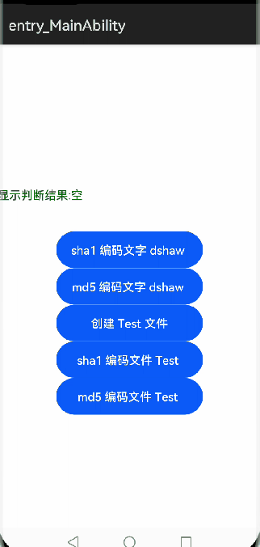

# Checksum

## 简介
用于计算最典型的散列函数，如 md5 或 sha1

## 效果展示：


## 下载安装
```shell
ohpm install @ohos/checksum
```
OpenHarmony ohpm环境配置等更多内容，请参考 [如何安装OpenHarmony ohpm包](https://gitcode.com/openharmony-tpc/docs/blob/master/OpenHarmony_har_usage.md) 。

## 使用说明
1. sha1、md5 编码文字

 ```
 @Entry
 @Component
 struct Index {
   @State mgs: string = "空"
   @State path: string = ""
   @State mArguments:options = new options();
 
   build() {
     Flex({ direction: FlexDirection.Column, alignItems: ItemAlign.Center, justifyContent: FlexAlign.Center }) {
       Button("sha1 编码文字 dshaw ").width(200).height(50).onClick((event: ClickEvent) => {
         this.mArguments.algorithm = "sha1"
         let mChecksum = new Checksum()
         
         this.mgs = mChecksum.checksum("dshaw", this.mArguments)
       })
 
       Button("md5 编码文字 dshaw ").width(200).height(50).onClick((event: ClickEvent) => {
         this.mArguments.algorithm = "md5"
         let mChecksum = new Checksum()
         
         this.mgs = mChecksum.checksum("dshaw", this.mArguments)
       })
       }
 ```
2. sha1、md5 编码文件内容

 ```
 @Entry
 @Component
 struct Index {
   @State mgs: string = "空"
   @State path: string = ""
   @State mArguments:options = new options();
 	//文件存在
   build() {
     Flex({ direction: FlexDirection.Column, alignItems: ItemAlign.Center, justifyContent: FlexAlign.Center }) {
       Button("sha1 编码文件 Test ").width(200).height(50).onClick((event: ClickEvent) => {
         this.mArguments.algorithm = "sha1"
         let mChecksum = new Checksum()
 
         mChecksum.checksumFile(this.path + "/Test.txt", this.mArguments, (err, data) => {
           this.mgs = "sha1 : " + data
         })
       })
 
       Button("md5 编码文件 Test ").width(200).height(50).onClick((event: ClickEvent) => {
 
         this.mArguments.algorithm = "md5"
         let mChecksum = new Checksum()
 
         mChecksum.checksumFile(this.path + "/Test.txt", this.mArguments, (err, data) => {
           this.mgs = "md5 :" + data
         })
       })
     }
 ```

## 接口说明

1. 编码字符串
```
public checksum(value, options)
```
2. 编码文件
```
checksumFile(filename, options, callback)
```

## 关于混淆
- 代码混淆，请查看[代码混淆简介](https://docs.openharmony.cn/pages/v5.0/zh-cn/application-dev/arkts-utils/source-obfuscation.md)
- 如果希望checksum库在代码混淆过程中不会被混淆，需要在混淆规则配置文件obfuscation-rules.txt中添加相应的排除规则：
```
-keep
./oh_modules/@ohos/checksum
```

## 约束与限制

在下述版本验证通过：

- DevEco Studio 版本： 4.1 Canary(4.1.3.317)

- OpenHarmony SDK:API11 (4.1.0.36)

## 目录结构

```
|---- checksum
|     |---- entry  # 示例代码文件夹
|     |----library  # 库文件夹
|         |----src
|            |----main
|              |----ets
|               |----checksum.ets #核心库
|               |----md5.ets #md5编码库
|               |----options.ets #类型实体
|               |----sha1.ets #sha1编码库
|     |---- README.md  # 安装使用方法  
|     |---- README_zh.md  # 安装使用方法  
```

## 贡献代码
使用过程中发现任何问题都可以提 [Issue](https://gitcode.com/openharmony-sig/ohos_checksum/issues) 给组件，当然，也非常欢迎给组件发 [PR](https://gitcode.com/openharmony-sig/ohos_checksum/pulls) 。

## 开源协议
本项目基于 [MIT License](https://gitcode.com/openharmony-sig/ohos_checksum/blob/master/LICENSE) ，请自由地享受和参与开源。